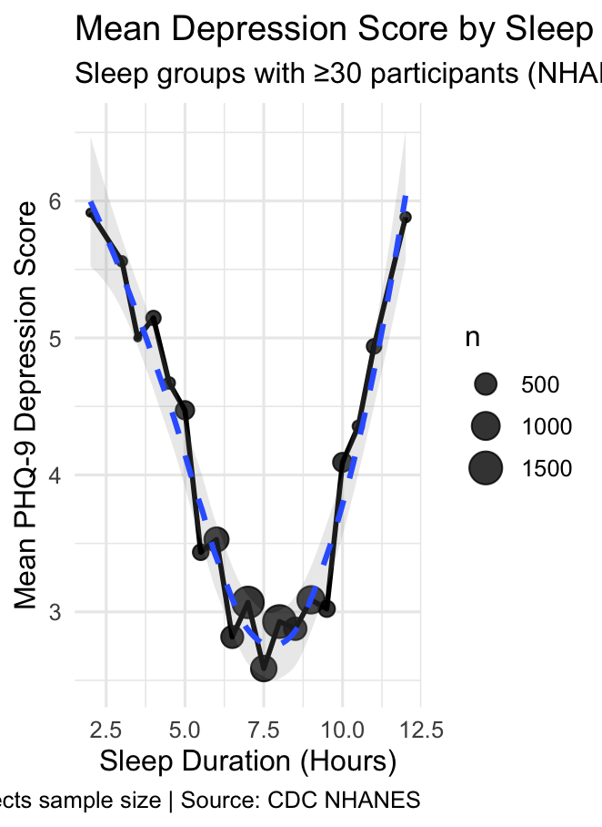

#  Sleep Duration and Depression: An Analysis of NHANES Data

## Overview
This project investigates the relationship between sleep duration and depressive symptoms using nationally representative data from the CDC’s NHANES survey. Depression severity was measured using the Patient Health Questionnaire (PHQ-9), a clinically validated tool widely used in research and healthcare.

Sleep plays a critical role in emotional regulation and cognitive function. This analysis explores how variations in sleep duration are associated with depression outcomes in a real-world population.

---

##  Research Question
How is sleep duration associated with depression severity in a general population sample?

---

##  Data Source
- **Dataset:** CDC NHANES (2017–2020)  
- **Sleep Variable:** SLD012 (hours of sleep)  
- **Depression Measure:** PHQ-9 (constructed from DPQ variables)  

NHANES provides a large, nationally representative sample of U.S. adults, making it well-suited for population-level behavioral analysis.

---

##  Methodology
- Merged sleep (SLQ) and depression (DPQ) datasets using participant ID (`SEQN`)  
- Constructed PHQ-9 depression scores (range: 0–27)  
- Removed invalid responses (NHANES special codes)  
- Filtered for complete cases (sleep + depression)  
- Conducted:
  - Descriptive statistics  
  - Correlation analysis  
  - Linear regression  
  - Quadratic regression (to test nonlinearity)  
  - Visualization using ggplot2 with LOESS smoothing  

---

##  Results
- A **U-shaped relationship** was observed between sleep duration and depression severity  
- Depression scores were lowest around **7–8 hours of sleep**  
- Both **short (<6 hours)** and **long (>9 hours)** sleep durations were associated with higher depression scores  
- This pattern remained consistent after restricting analysis to sleep groups with sufficient sample sizes (n ≥ 30)  

---

##  Statistical Analysis
- A Pearson correlation analysis showed a relationship between sleep duration and depression severity  
- A linear regression model suggested that sleep duration alone does not fully capture variation in depression scores  
- A **quadratic regression model revealed a significant nonlinear effect**, supporting a U-shaped relationship  
- These results indicate that both insufficient and excessive sleep are associated with increased depressive symptoms  

---

##  Visualization

---

##  Interpretation
The findings suggest that optimal sleep duration is associated with lower depression severity, while both insufficient and excessive sleep are linked to worse mental health outcomes. This aligns with existing psychological research on sleep and emotional regulation.

Importantly, this analysis is **observational**, meaning it identifies associations rather than causal relationships. Other factors such as stress, physical health, and lifestyle may also influence these results.

---

##  Future Work
- Apply regression models controlling for demographic variables  
- Incorporate additional behavioral and health factors  
- Explore longitudinal data for causal insights  
- Expand analysis to other mental health indicators  

---

##  Tools Used
- R  
- haven  
- dplyr  
- ggplot2  

---

## 👤 Author
Samuel Stinelli
